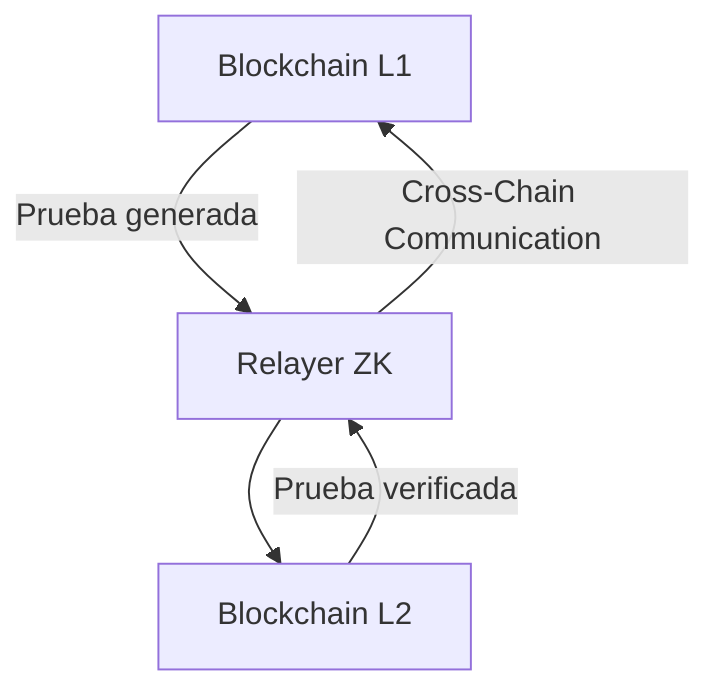

# FPUNA ZK-Bridge 🔗

🚀 **FPUNA-ZK-Bridge** es una organización académica de la **Facultad Politécnica – Universidad Nacional de Asunción (FP-UNA)**, dedicada a la investigación y desarrollo de protocolos de puentes (bridges) entre blockchains utilizando **pruebas de conocimiento cero (Zero-Knowledge Proofs, ZKPs) con NOIR**.

## 🎯 Objetivo

Los puentes entre cadenas (cross-chain bridges) son componentes críticos en el ecosistema blockchain, pero suelen ser el punto más vulnerable de seguridad. Nuestro objetivo es investigar y prototipar soluciones basadas en **Zero-Knowledge Proofs** que permitan:

- ✅ **Transferencias seguras** de información y activos entre cadenas
- ✅ **Validación ligera** de estados sin necesidad de nodos completos
- ✅ **Reducción de la confianza** depositada en relayers centralizados

## 🧩 Tecnologías Principales


- **Noir** → Lenguaje para circuitos de conocimiento cero
- **UltraHonkBackend (Aztec)** → Backend para pruebas rápidas y eficientes
- **Hardhat & Anvil** → Redes locales para despliegue y pruebas
- **Ethers.js** → Conexión y automatización de transacciones
- **Relayers** → Servicios de observación y reenvío de eventos

## 🏗️ Arquitectura General



```
┌─────────────────────────────────────────────────────────────────────────────┐
│                           FPUNA ZK-BRIDGE ARCHITECTURE                     │
└─────────────────────────────────────────────────────────────────────────────┘

    L1 (Blockchain)                                      L2 (Blockchain)
    ┌─────────────────────────┐                        ┌─────────────────────────┐
    │                         │                        │                         │
    │  📦 Smart Contracts     │                        │  📦 Smart Contracts     │
    │  🔒 Lock Events         │                        │  🏭 Mint/Unlock Events  │
    │  📋 State Proofs        │                        │  ✅ ZK Verification     │
    │                         │                        │                         │
    └─────────────────────────┘                        └─────────────────────────┘
              │                                                        ▲
              │ 1. Event Detection                                     │
              │ 2. State Proof Generation                              │ 4. ZK Proof Verification
              │                                                        │ 5. Execute Transaction
              └──────────────────┐                                     │
                                 │                                     │
                                 ▼                                     │
                        ┌─────────────────────┐                       │
                        │   🤖 RELAYER ZK     │───────────────────────┘
                        │                     │
                        │ • Event Monitoring  │ 3. ZK Proof Generation
                        │ • Noir Circuit      │    (Noir + UltraHonk)
                        │ • Proof Generation  │
                        │ • Cross-chain Relay │
                        └─────────────────────┘
```

**Componentes:**

- **L1 / L2**: Cadenas locales o testnets públicas
- **Relayer ZK**: Transforma eventos en pruebas y facilita la verificación entre redes
- **ZK-Proofs**: Aseguran que la información transferida sea válida sin exponer datos sensibles

## 📂 Proyectos Actuales

### 🌟 [Guarani Bridge](./guarani-bridge)

_Prototipo de investigación_

Prototipo de puente entre dos cadenas locales (Hardhat + Anvil) con soporte para relayer y pruebas iniciales con **Noir**.

**Características de investigación:**

- 🔒 **Lock-and-Mint Pattern** con protección contra replay
- 🤖 **Relayer Automatizado** para transferencias sin fricción
- 🛡️ **Arquitectura Segura** con roles y permisos granulares
- 🧪 **Entorno de Testing** completo para desarrollo local
- 🔬 **Integración ZK** (en desarrollo con Noir)

[📖 Ver Documentación Completa](./guarani-bridge/readme.md) | [🔗 Repositorio](./guarani-bridge)

_(Se agregarán más repositorios a medida que avancen los módulos de la investigación.)_

---

## 👥 Equipo

Este proyecto es parte de la **tesis de grado** de estudiantes de la **Facultad Politécnica – Universidad Nacional de Asunción (FP-UNA)**, con orientación en:

- 🔗 **Blockchain & Seguridad**
- 🔒 **Zero-Knowledge Proofs**
- 🌐 **Sistemas Distribuidos**
- 🧪 **Investigación Aplicada**

### Áreas de Especialización

- **Criptografía aplicada** con enfoque en ZK-SNARKs
- **Arquitecturas de bridges** y protocolos cross-chain
- **Optimización de gas** y escalabilidad
- **Seguridad en smart contracts**

## 📄 Licencia

Proyectos de código abierto bajo licencia **MIT** para fomentar la investigación y educación en el ecosistema blockchain.

---

<div align="center">

### 🎓 **Facultad Politécnica – Universidad Nacional de Asunción**

**🔗 Investigación en Zero-Knowledge Bridges**

[](https://www.pol.una.py/)
[](#)
[](LICENSE)

</div>

